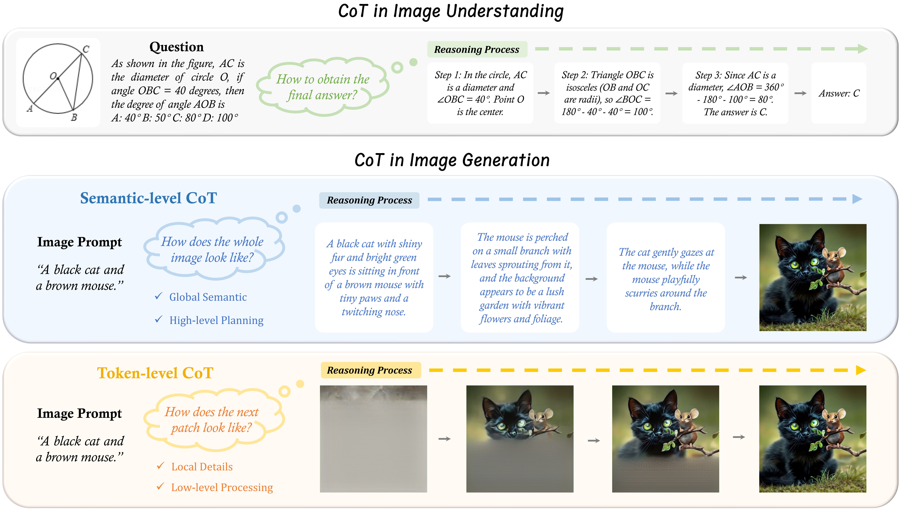
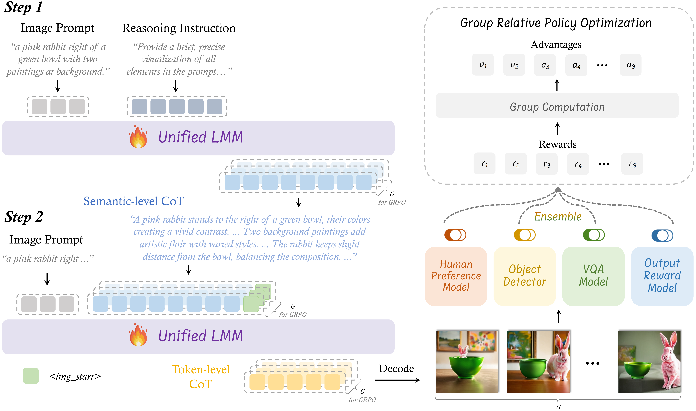

# 🌟🔥 T2I-R1: Reinforcing Image Generation with Collaborative Semantic-level and Token-level CoT

Official repository for the paper "[T2I-R1: Reinforcing Image Generation with Collaborative Semantic-level and Token-level CoT](https://arxiv.org/pdf/2505.00703)".

[[📖 Paper](https://arxiv.org/pdf/2505.00703)] 

### 💥 News
- **[2025.05.02]** We release the [arxiv paper](https://arxiv.org/pdf/2505.00703) and the training code. 🔥
- **[2025.02.28]** Our previous work: [*Can We Generate Images with CoT? Let's Verify and Reinforce Image Generation Step by Step*](https://arxiv.org/pdf/2501.13926?) is accepted by **CVPR 2025** 🎉

### 🗒️ TODO

- [ ] Release ORM Checkpoint and reward code (coming within a week)

- [ ] Release Checkpoint (coming within two weeks)


## 👀 Reasoning in Image Generation

Chain-of-Thought (CoT) reasoning with reinforcement learning (RL) has been extensively explored by LLMs and LMMs. However, applying such reasoning strategies to the visual generation domain remains largely unexplored.  In this project, we provide **T2I-R1**, a novel reasoning-enhanced text-to-image generation model powered by RL with a bi-level CoT reasoning process.


<p align="center">
     <br>
</p>

We identify two levels of CoT that can be utilized to enhance different stages of generation:
1. 🧠 **Semantic-level CoT** is the **textual reasoning about the image to generate**, which is introduced prior to the image generation. The semantic-level CoT designs the **global structure** of the image, e.g., the appearance and location of each object.
   Optimizing the semantic-level CoT could explicitly manage the planning and reasoning of the prompt before the subsequent image tokens generation, making the generation easier.
   
3. 🎨 **Token-level CoT** is the intermediate patch-by-patch generation process of the image. Unlike semantic-level CoT, token-level CoT focuses on **low-level details** like pixel generation and maintaining visual coherence between adjacent patches. 
   Optimizing the token-level CoT can enhance both the generation quality and the alignment between the prompt and the resulting images.

To better coordinate these two levels of CoT, we introduce **BiCoT-GRPO** with an ensemble of generation rewards, which seamlessly **optimizes both generation CoTs within the same training step**:

<p align="center">
     <br>
</p>

## 💪 Get Started
### Installation

Clone the repository:

   ```bash
   git clone https://github.com/CaraJ7/T2I-R1.git
   cd T2I-R1
   ```

Create a conda environment:

   ```bash
   conda create -n t2i-r1 python=3.10
   conda activate t2i-r1
   ```
   Please follow the instructions [here](https://pytorch.org/get-started/locally/) to install both PyTorch and TorchVision dependencies.

   Install additional dependencies:
   ```bash
   pip install -r requirements.txt
   ```
   Install GrouningDINO
   ```bash
   cd t2i-r1/src/t2i-r1/src/utils/GroundingDINO
   pip install -e .
   ```
   Note that other newer versions of torch, transformers, and trl may also work.

### Prepare Reward Model Checkpoints

   ```bash
   cd t2i-r1
   mkdir reward_weight
   cd reward_weight
   ```

   - Download HPS checkpoint from [this link](https://huggingface.co/xswu/HPSv2/resolve/main/HPS_v2.1_compressed.pt) by
   ```bash
   wget https://huggingface.co/xswu/HPSv2/resolve/main/HPS_v2.1_compressed.pt
   ```
   - Download GIT checkpoint from [this link](https://huggingface.co/microsoft/git-large-vqav2) by
   ```bash
   huggingface-cli download microsoft/git-large-vqav2 --repo-type model --local-dir git-large-vqav2
   ```

   - Download GroundingDINO checkpoint from [this link](https://github.com/IDEA-Research/GroundingDINO/releases/download/v0.1.0-alpha/groundingdino_swint_ogc.pth) by
   ```bash
   wget https://github.com/IDEA-Research/GroundingDINO/releases/download/v0.1.0-alpha/groundingdino_swint_ogc.pth
   ```

### 🚀 Training 

```bash
cd t2i-r1/src
bash scripts/run_grpo.sh
```
Make sure to substitute the correct checkpoint path and config path in the `run_grpo.sh`


### 💫 Inference              
```
cd t2i-r1/src/infer
python reason_inference.py \
--model_path YOUR_MODEL_CKPT \
--data_path test_data.txt 
```

### 📒 Notes
+ We modify the code in `t2i-r1/src/t2i-r1/src/utils/GroundingDINO/groundingdino/models/GroundingDINO/groundingdino.py` to adapt to Zero3 training.

### 🧠 Related Work

Explore our additional research on **Autoregressive Text-to-Image Generation** and  **CoT Reasoning** 

- **[Image Generation CoT]** [Can We Generate Images with CoT? Let's Verify and Reinforce Image Generation Step by Step?](https://arxiv.org/pdf/2501.13926)
- **[MME-CoT]** [MME-CoT: Benchmarking Chain-of-Thought in Large Multimodal Models for Reasoning Quality, Robustness, and Efficiency](https://mmecot.github.io)
- **[MathVerse]** [MathVerse: Does Your Multi-modal LLM Truly See the Diagrams in Visual Math Problems?](https://mathverse-cuhk.github.io)
- **[MAVIS]** [MAVIS: Mathematical Visual Instruction Tuning with an Automatic Data Engine](https://arxiv.org/pdf/2407.08739)
- **[MMSearch]** [MMSearch: Unveiling the Potential of Large Models as Multi-modal Search Engines](https://mmsearch.github.io/)

### 🥳 Acknowledgements
We would like to thank [R1-V](https://github.com/Deep-Agent/R1-V) and [Image Generation CoT](https://github.com/ZiyuGuo99/Image-Generation-CoT), upon which our repo is built.
